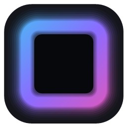
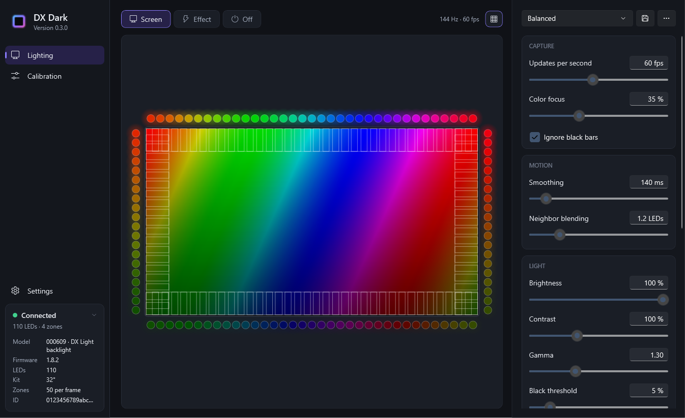
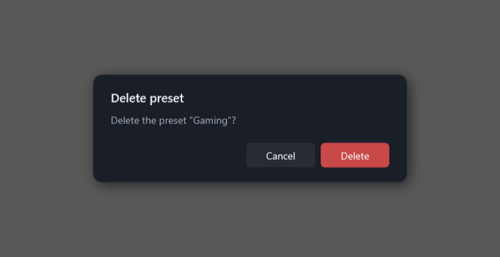
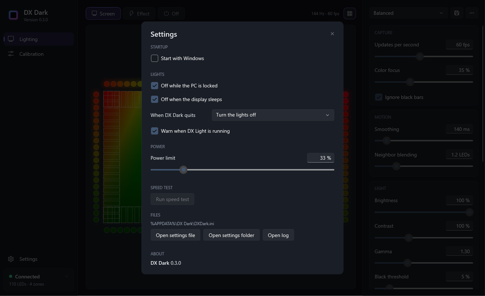
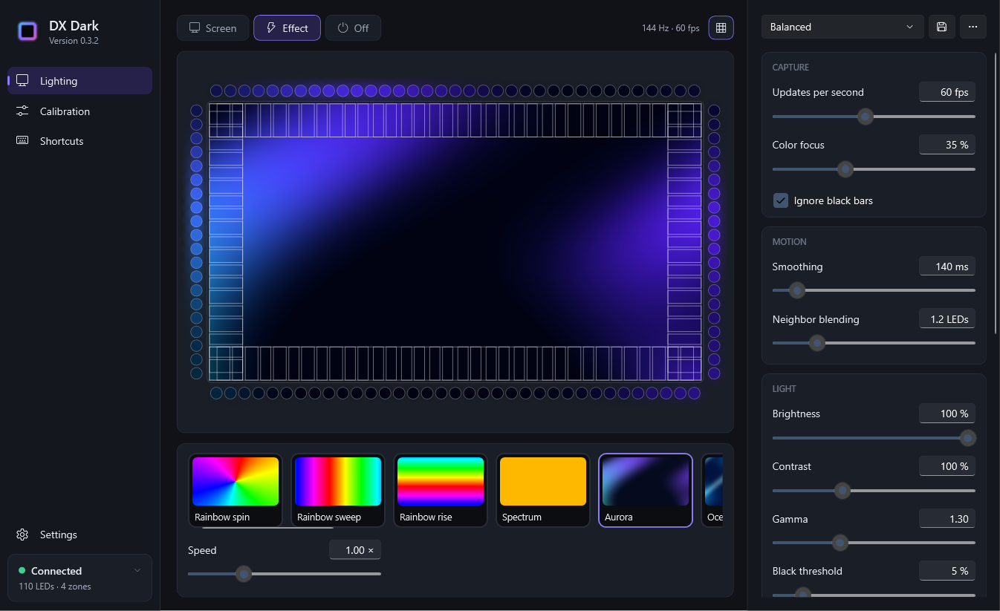
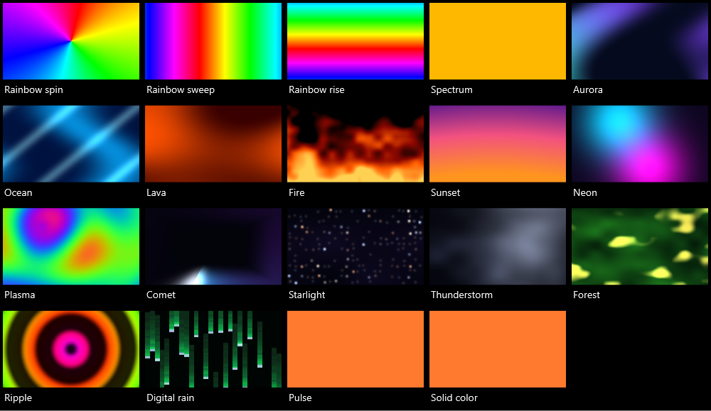
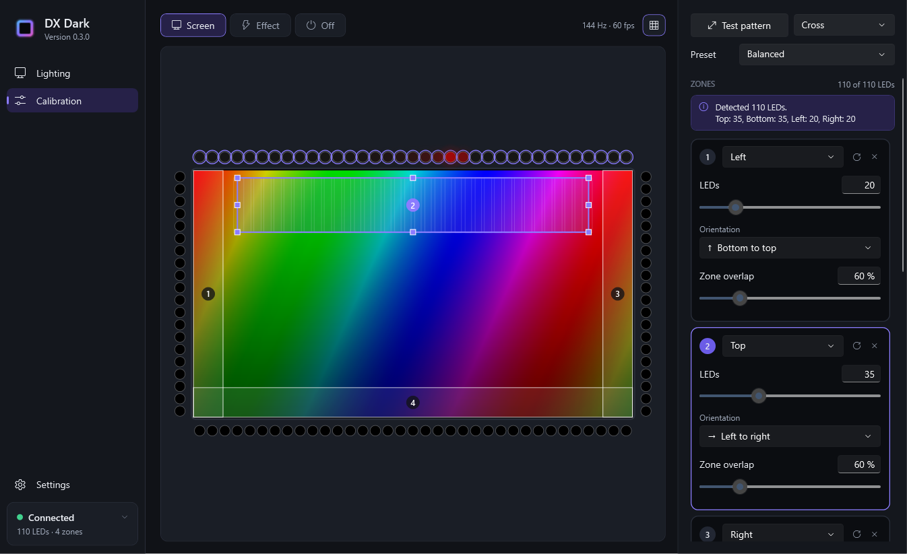
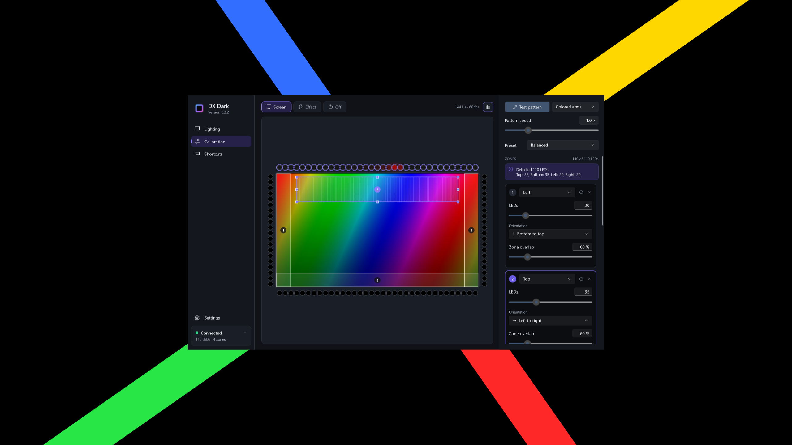
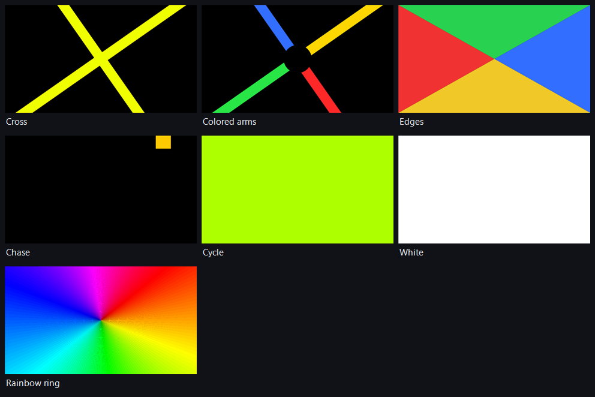
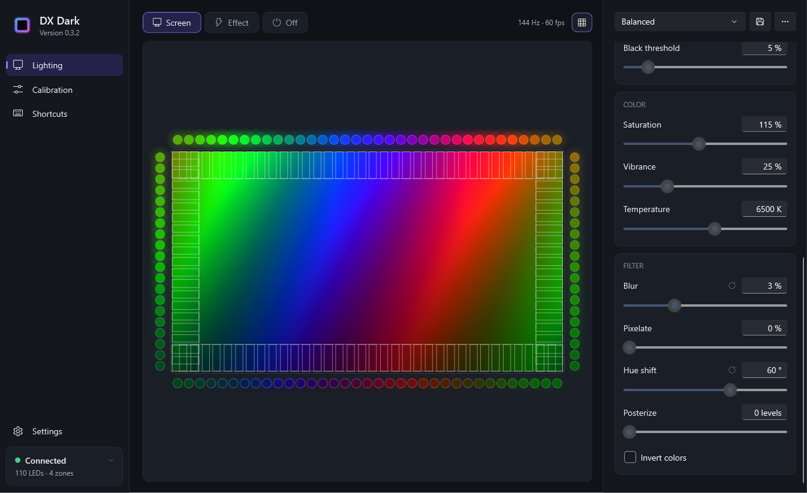

# DX Dark

A replacement for the **DX Light** app that drives an ambilight light strip setup.

DX Dark is a Windows tray app that improves upon the barebones driver provided by the original manufacturer.





*Screenshots are made by DX Dark's own snapshot mode from a built-in test picture.*

## Contents

- [Why it exists](#why-it-exists)
- [Features](#features)
- [Getting started](#getting-started)
- [The control panel](#the-control-panel)
- [Effects and your own videos](#effects-and-your-own-videos)
- [Calibration](#calibration)
- [Preset settings explained](#preset-settings-explained)
- [The settings file](#the-settings-file)
- [Supported hardware](#supported-hardware)
- [Privacy](#privacy)
- [Troubleshooting](#troubleshooting)v
- [How it works](#how-it-works)
- [What we learned about the strip](#what-we-learned-about-the-strip)
- [Building from source](#building-from-source)
- [Project layout](#project-layout)
- [Command-line test tool](#command-line-test-tool)
- [Known limitations](#known-limitations)
- [Changelog](#changelog)

## Why it exists

The strip ships with *DX Light* (Robobloq, `quiklight-desktop` 3.11.0), an Electron app that:

- checks for updates over **unencrypted HTTP** (`static.robobloq.cn`), so an update could be
  tampered with on the network;
- sends crash reports to Sentry, and log files, a machine ID and optional contact details to
  `feedback.robobloq.cn` when you use its feedback form;
- includes a closed-source native module for screen capture;
- can register itself to always run as administrator and changes the Windows transparency setting.

It also looks worse than it needs to: by default it samples **one pixel** per zone of a coarse
16×9 grid, copies that color to blocks of 2–3 LEDs, and snaps dark colors to black at a hard
threshold, which causes abrupt, flickery jumps when objects move across the screen.

## Features

- **Smooth screen sync**: averages whole zones in linear light, blends neighboring LEDs and fades
  over time, so moving objects glide along the strip instead of jumping.
- **Works the same at any refresh rate** (30, 60, 144, 240 Hz…): capture follows the monitor,
  updates go to the strip at a fixed rate (default 60 per second), and fades are timed in
  milliseconds rather than frames.
- **One-page control panel**: the live view is always visible, with the preset settings in a
  strip beside it. Every slider edits the live view as you move it.
- **Presets** (Balanced, Cinema, Gaming, Vivid, Soft ambience, Faithful), fully editable; save
  your own with one click, plus rename / delete / reset / import / export.
- **Filters** in the Soft Ambience style: blur, pixelate, hue shift, posterize and invert, applied
  to the picture before it is sampled.
- **Black bars handled smoothly**: letterbox and pillarbox bars are detected, kept through fades to
  black, and when they appear or go the LEDs fade over to the new picture area instead of jumping.
- **Effects in the Soft Ambience style**: an effect is a moving picture that the strip samples
  exactly like the screen. Nineteen are built in (rainbows that spin, sweep sideways or rise,
  fire, a forest, ripples, digital rain, a thunderstorm and more), and **you can add your own videos**.
- **Calibration in the control panel**: set up the zones while your own picture stays on the
  screen. The selected zone shows on the strip as a red dot running from its first LED to its
  last, so you can see which way it runs. You choose exactly which part of the screen each zone
  samples by dragging and resizing its area in the live view, separately for each preset. A test
  pattern can be shown behind the control panel when you want one.
- **All settings in one plain text file** (`DXDark.ini`) that you can open, back up or edit by
  hand; DX Dark picks up your edits as soon as you save. Nothing goes in the registry, and
  entries earlier versions left there are removed.
- **Tray menu** for everyday use: screen, effects, off, presets, brightness, calibration.
- Lights off automatically while the PC is **locked**, **asleep** or the **display is off**.
- Reconnects automatically when the strip is unplugged and plugged back in.
- Optional start with Windows (a shortcut in your Startup folder; no administrator rights).

## Getting started

1. **Close DX Light** and turn off its start-at-login (or uninstall it). Two apps driving the
   strip at once will fight.
2. Copy `Releases\v0.3.1\DXDark-v0.3.1.exe` anywhere you like and run it. Nothing to install:
   the .NET runtime is built in. Windows SmartScreen may warn about an unknown publisher the
   first time, because the file is not code-signed.
3. The first time, DX Dark has no zones and opens on **Calibration**. It shows how many LEDs it
   detected and how many belong on each side (for example "Detected 110 LEDs. Top: 35, Bottom: 35,
   Left: 20, Right: 20" on the 32" kit). Add the zones one by one, starting where the cable plugs
   into the strip (see [Calibration](#calibration)).
4. Optionally open **Settings** and tick **Start with Windows** (DX Dark then starts in the tray).

Closing the window keeps DX Dark running in the tray; double-click the tray icon to open it again
and use **Quit DX Dark** in its menu to exit. Running the exe again just reopens the control
panel. Settings, zones and presets from earlier versions are kept.

To check the download, compare its checksum with `Releases\v0.3.1\SHA256SUMS-v0.3.1.txt`:

```powershell
Get-FileHash .\DXDark-v0.3.1.exe -Algorithm SHA256
```

## The control panel

| Area | What it does |
|---|---|
| **Screen / Effect / Off** | What the strip shows. |
| **Live view** | The picture being sampled, with the preset's color processing applied, each LED's sampling zone (toggle with the grid button), and the color going to every LED. |
| **Effect gallery** | Appears in Effect mode, on Lighting and on Calibration: built-in effects, your videos, **Add video**, speed and (for Solid color and Pulse) the color. |
| **Preset strip** (right, on Lighting) | The preset dropdown at the top, **save preset** next to it (keep the name to overwrite the current preset, after a confirmation, or type a new name to save a new one), and **⋯** for rename, reset, delete, import and export. Below, in their own sections: Capture, Motion, Light, Color and Filter. Changes save automatically to the selected preset. |
| **Calibration** (sidebar) | Swaps the preset strip for the test pattern controls, the preset, the zones and LED color, next to the live view, where each zone's area can be dragged and resized. A warning sign appears here (and on the live view) while no zones are set. |
| **Settings** (sidebar) | Startup, lock/sleep behavior, what happens on quit, power limit, speed test, and the settings file. |
| **Connected card** (sidebar) | Strip status with its LED and zone count ("110 LEDs · 4 zones"); click it for model, firmware, kit size and device ID. |

**Tray icon:** double-click opens the control panel; right-click opens the menu. Full color means
the strip is lit, dimmed that it is off or paused, grey that no strip is connected.

Questions, names and file choices (saving a preset, adding a video…) open in DX Dark's own dark
dialogs rather than Windows' light ones.





**The strip's buttons:** pressing Power, M or the music button hands control to the strip
(DX Dark stops sending, exactly like DX Light). Pick Screen or Effect in DX Dark to take over again.

## Effects and your own videos

An effect is a picture that changes over time; DX Dark samples its edges with your zones and
preset, just like the screen. That means presets, zone areas and white balance apply to effects too,
and the live view shows exactly what is being sampled.



Built in:



| Effect | What it looks like |
|---|---|
| Rainbow spin | A rainbow turning around the middle of the screen. |
| Rainbow sweep | Rainbow bands travelling sideways along the top and bottom. |
| Rainbow rise | Rainbow bands travelling upwards along the sides. |
| Spectrum | The whole strip fading slowly through every color. |
| Aurora | Green and violet curtains drifting over a night sky. |
| Ocean | Deep blue water with moving light. |
| Lava | Slow, glowing red and orange blobs. |
| Fire | Flames licking up from the bottom. |
| Sunset | Violet above, pink and orange below, gently drifting. |
| Neon | Magenta and cyan glows circling each other. |
| Plasma | Flowing bands of color. |
| Comet | A bright comet with a glowing tail circling the screen. |
| Starlight | A night sky of softly twinkling stars. |
| Thunderstorm | Dark, drifting clouds lit now and then by lightning. |
| Forest | Deep greens with patches of sunlight drifting through swaying leaves. |
| Ripple | Rings of color spreading out from the middle of the screen. |
| Digital rain | Green streaks falling down the screen. |
| Pulse | Your color, slowly breathing. |
| Solid color | Your color. |

**Speed** changes how fast an effect plays.

**Add video** turns any video into an effect. DX Dark checks that Windows can play it and copies
it into its library (`%APPDATA%\DX Dark\Videos`), so the original can be moved or deleted. It plays
on a loop and only the edges matter, so short, colorful loops work best. Formats are whatever
Windows can decode: MP4 (H.264, and HEVC if the HEVC extension is installed), MOV, M4V, WMV, AVI
and MKV. Remove a video with the ✕ on its tile.

## Calibration

Calibration is a page of the control panel: the zones and LED color replace the preset strip,
next to the live view, while the strip keeps showing your screen (or effect). That way you can
adjust everything against whatever is already on the screen.



**Zones** are the parts of the strip along each edge of the screen, in order from the end where
the cable plugs in. The note at the top says how many LEDs DX Dark detected and how many belong
on each side; use it as a guide for the LED counts.

- **Add zone** adds the next zone, guessing its edge and direction from the zone before it, and
  selects it.
- The selected zone glows on the strip while a **red dot keeps running from its first LED to its
  last**, until you click the zone again, click anywhere outside it, pick another zone or leave
  Calibration.
- **LEDs**: a slider up to the strip's whole LED count. While you drag it, the zone's LEDs glow on
  the strip so you can see where it ends; the red dot starts again once you let go. ↺ goes back
  to the detected count.
- **Orientation**: pick the direction the red dot ran: left to right, right to left, top to
  bottom or bottom to top. The dot in the live view runs the way the orientation says, so the
  two should match.
- **Edge**: which side of the screen the zone is on.
- **Zone overlap**: how much each LED's slice of the zone's area overlaps its neighbors. More
  overlap gives softer transitions.
- **↺** on the card puts the zone's area back to the whole edge.
- **Click a zone** to select it, and click it again (or anywhere else) to deselect it; ✕ removes it.

**Zone areas.** On the Calibration page the live view shows the part of the screen each zone
samples as a numbered rectangle. Its LEDs share the area out along their edge, in order, so an
area can be shorter than the edge (to skip a corner or a taskbar) or deeper into the picture.

- Click a zone's area (or its card) to select it; it turns purple and gets handles.
- Drag the area to move it, or drag a handle to resize it. The strip follows as you drag.
- With a zone selected, the arrow keys move its area in small steps (Shift for bigger steps).
- Click the selected area again, or anywhere outside the zones, to deselect it.
- Areas may reach a little past the edge of the picture, for a strip mounted a bit off; sampling
  stops at the picture's edge. Black bars are left out, as on the Lighting page.

Areas and overlap are saved **in the preset** chosen at the top of the page (the same preset as on
the Lighting page), so for example Cinema can sample deeper into the picture than Gaming. A zone
without an area of its own uses the whole edge, as deep as the preset's usual depth. Saving a
preset under a new name copies its areas; **Reset to defaults** puts them back to the whole edge.

While no zones are set the strip stays dark, and a small warning says so.

**LED color:** red, green and blue gains for white balance, the strip's own **Strip brightness**
(applied on top of each preset's brightness), and the channel order, for strips wired differently
from RGB.

**Test pattern** (at the top of the Calibration page) shows a test pattern on the synced monitor,
behind the control panel, so you keep using the same controls. Pick the pattern in the dropdown
next to it (picking one also shows it); **Pattern speed** appears while it shows. The strip never
samples the middle of the screen (zones stay within the outer 15 % while the pattern shows, and
black-bar detection is off). If the control panel is maximized or reaches into the edges, DX Dark
moves it to the middle of that screen, and puts it back when the pattern goes. Press the button
again or Esc to hide the pattern; leaving Calibration hides it too.



| Pattern | Use |
|---|---|
| Cross | A cross that turns and changes color: every LED should follow it smoothly. |
| Colored arms | Red, green, blue and yellow arms around a black center: shows the direction the strip runs. |
| Edges | Left red, top green, right blue, bottom yellow: checks the edge of each zone. |
| Chase | A block running clockwise around the border and through every color. |
| Cycle | The whole screen fading through every color. |
| White | For white balance (the LED color gains). |
| Rainbow ring | Every hue around the screen: checks that zones join up at the corners. |



## Preset settings explained

| Setting | What it does |
|---|---|
| Updates per second | How often the strip is updated (default 60). |
| Color focus | 0 % averages the zone; higher values let vivid colors win over grey and black. |
| Ignore black bars | Detects letterbox and pillarbox bars and samples the picture inside them. |
| Smoothing | Fade time in milliseconds. Higher is calmer, lower reacts faster. |
| Neighbor blending | Blends each LED with nearby LEDs so motion glides along the strip. |
| Brightness | Brightness of the strip. |
| Saturation / Vibrance | Color intensity; vibrance boosts muted colors more than vivid ones. |
| Contrast | Spreads darks and brights apart. |
| Gamma | 1.00 sends the picture as-is (like DX Light); higher values deepen mid-tones. |
| Temperature | 6500 K is neutral; lower is warmer, higher is cooler. |
| Black threshold | Very dark parts of the picture fade the LEDs out smoothly instead of looking muddy. |
| Blur | Gaussian blur of the picture before it is sampled, as a share of its height. |
| Pixelate | Turns the picture into blocks of this size. |
| Hue shift | Turns every color around the color wheel (in degrees). |
| Posterize | Reduces each color channel to this many levels (0 is off). |
| Invert colors | Swaps every color for its opposite. |

Each preset also keeps the area and overlap of every zone, set on the Calibration page. The
filters change the picture itself, so the live view shows them too:



Hover a setting's name for a short explanation; double-click it, or use ↺, to reset it.

## The settings file

Everything DX Dark remembers is in one text file, `%APPDATA%\DX Dark\DXDark.ini` (Settings →
**Open settings file** opens it in Notepad). DX Dark saves every change there half a second after
you make it. You can also edit the file yourself while DX Dark runs: it reloads the file as soon
as you save it.

Values use the same units as the control panel, so they read the way they look on screen:

```ini
[General]
Mode = Screen
Preset = Cinema
Monitor = Primary

[Strip]
Brightness = 100%
PowerLimit = 33.33%
ColorOrder = RGB

[Zone 1]
Edge = Right
LEDs = 20
Orientation = BottomToTop

[Preset 1]
Name = Cinema
SamplingDepth = 18%
ZoneOverlap = 100%
Smoothing = 320 ms
Temperature = 6000 K
Blur = 2%
HueShift = 0 deg
Posterize = Off
Zone1Area = x 92.5%, y -20%, width 7.5%, height 100%, overlap 60%
```

`ZoneNArea` is the area zone N samples in that preset, measured from the top-left of the picture;
`SamplingDepth` and `ZoneOverlap` are the usual area for zones without one. Short comments in
the file list the choices for each setting. Values that are missing or out of
range fall back to their defaults, and lines starting with `;` are ignored. Exported presets use
the same format (`.ini`); presets exported by 0.0.1–0.0.2 (`.json`) can still be imported.

Start with Windows is stored here too (`StartWithWindows = true`); DX Dark creates or deletes its
shortcut in the Startup folder to match.

Settings from 0.0.1–0.0.2 (`settings.json`) are converted the first time a newer version starts;
the old file is kept as `settings.0.0.2-backup.json` and is never read again. Deleting
`DXDark.ini` (even while DX Dark runs) starts over from a fresh setup with no zones.

## Supported hardware

DX Dark talks to controllers with USB ID **1A86:FE07** (manufacturer string "ROBOBLOQ").
Zones are built in for the DX Light screen-sync backlights by 东莞市大显光照明科技有限公司
(Dongguan Daxian Lighting):

| Model ID | 24" | 27" | 28" | 32" | 34" |
|---|---|---|---|---|---|
| `000609` | 29 / 17 | 29 / 17 | 36 / 18 | 35 / 20 | 41 / 17 |
| `000603` | 26 / 14 | 29 / 17 | – | 35 / 20 | 41 / 17 |
| `00060c` | 27 / 15 | 30 / 18 | – | 36 / 21 | 42 / 18 |
| `00060d` | 27 / 15 | 30 / 18 | 37 / 19 | 36 / 21 | 42 / 18 |

(LEDs per horizontal / vertical side; four sides, factory wiring starting bottom-left, clockwise.)
The strip reports its model, kit size and LED count, and Calibration shows these counts as the
guide for your zones. For other strips speaking the same protocol the counts are estimated from
their LED count and the monitor's shape.

DX Light's Bluetooth dongle, keyboards and mice are not supported.

## Privacy

- **No network access at all.** No accounts, telemetry, crash reporting, update checks or
  feedback uploads. There is no networking code in the project.
- Talks only to the strip, through Windows' own HID API (`hid.dll`, `setupapi.dll`); no drivers
  are installed.
- Never asks for administrator rights (`asInvoker` manifest).
- Screen images are analyzed in memory and never saved. The live view shows them only inside the
  control panel.
- Settings (`DXDark.ini`), added videos (`Videos\`) and a small log (`dxdark.log`, capped at
  about 1 MB) are kept in `%APPDATA%\DX Dark`.
- Nothing is written to the registry. "Start with Windows" is a setting in `DXDark.ini` plus a
  shortcut, `DX Dark.lnk`, in your Startup folder (`shell:startup`); unticking the option deletes
  it. At every start DX Dark removes the registry values 0.0.1–0.0.2 used for this (the `Run`
  entry and Windows' Task Manager record of it). Windows itself keeps its usual history of
  programs you have run (for example the `MuiCache`); that is not DX Dark's.
- The strip's own "open a web address" keyboard feature is switched off every time DX Dark connects.
- Third-party code: [Vortice.Windows](https://github.com/amerkoleci/Vortice.Windows)
  (MIT license) for Direct3D/DXGI screen capture and Media Foundation video decoding, and xUnit
  for the tests (not shipped).

**To uninstall:** untick "Start with Windows" (or delete `DX Dark.lnk` from `shell:startup`), quit
DX Dark from the tray, then delete the exe and the `%APPDATA%\DX Dark` folder.

## Troubleshooting

| Problem | Fix |
|---|---|
| "Plugged in but not responding" | Unplug the strip and plug it back in. Its stored setup is not affected. |
| Lights flicker or two apps seem to fight | Make sure DX Light is closed (DX Dark warns when it sees it running). |
| The strip stays dark | No zones are set yet (a warning shows on the live view): open Calibration and add them. |
| A side shows the wrong colors | Calibration → click the zone, watch the red dot, and set its edge and orientation to match. |
| Colors are a few LEDs off along a side | Calibration → select the zone and move its area in the live view (or with the arrow keys). |
| Red looks green or blue | Calibration → LED color → Color order. |
| Whites look tinted | Calibration → Test pattern → White, then adjust the red/green/blue gains. |
| The top and bottom LEDs go dark during letterboxed movies | Make sure Ignore black bars is on in the preset. Bars are kept through fades to black; when they are found again after a scene change, the LEDs fade over in under a second. |
| Everything looks dim | Check Strip brightness (Calibration → LED color) and the preset's Brightness. |
| An edit to DXDark.ini didn't apply | The file needs its `[General]` section; the log says "reloading it" when an edit is picked up. |
| A video won't add | Windows can't decode it (common for WebM/VP9, or HEVC without the extension). Convert it to H.264 MP4. |
| Lights stay dark with full-screen games or DRM video | Windows blocks capture of protected video (it appears black). Some exclusive-fullscreen games behave the same; borderless window mode works. |

The log at `%APPDATA%\DX Dark\dxdark.log` records connections and, once a minute while syncing,
the picture and update rates.

## How it works

```
Screen (Desktop Duplication, averaged on the GPU to 320–480 pixels wide)
  or effect (drawn in code, 192×108)  or video (Media Foundation, decoded at ~320 wide)
        │
        ▼
Black-bar detection (fading over when bars appear or go) ─► filters (blur, pixelate, hue, posterize, invert)
        │
        ▼
One sampling zone per LED (its share of its zone's area, plus overlap) ─► zone averages
        │                                       (summed-area tables: any zone size costs the same)
        ▼
Black threshold ─► neighbor blending ─► time-based smoothing ─► saturation / vibrance /
contrast / temperature / gamma / brightness ─► white balance ─► power limit ─► 8-bit values
        │                                                     (with a small dead band against flicker)
        ▼
50 fixed color zones in one sync packet ─► USB HID ─► strip
```

The live view runs the same color processing over the whole picture (through a 3D lookup table),
which is why moving a color slider changes the preview image itself. While Calibration shows a
zone, the engine draws the zone and its red dot instead of the picture, keeping each LED's exact
color but still sending the same 50 ranges per frame.

## What we learned about the strip

Found by reading DX Light's code and testing on a model `000609`, firmware 1.8.2 strip:

- It is a USB HID device (VID `1A86`, PID `FE07`). Commands go to the vendor-defined interface
  (usage page `0xFF00`) as 65-byte reports: report ID 0 followed by 64 bytes.
- **Command packet:** `'R' 'B' length sequence command payload… checksum`, where the checksum is the sum
  of all earlier bytes modulo 256. **Sync frame:** `'S' 'C'` with a 2-byte length, then
  command `0x80` and 5-byte ranges `[first LED, R, G, B, last LED]`.
- The strip **stores its setup** (model, kit size, LED count) permanently, but **forgets colors
  and effects** when unplugged and starts in its rainbow effect.
- **Every frame must be one packet of at most 50 ranges.** A single 110-range packet (557 bytes)
  hung the controller until it was power-cycled, and splitting a frame over several packets made
  the start of the strip flicker. At 50 ranges the strip accepts about 99 frames per second.
- Version 0.0.1 merged neighboring zones of the same color, so a small object moving over a dark
  screen produced frames whose size changed from one frame to the next. That is the likely cause
  of its occasional flicker at the start of the strip. DX Dark now sends the same 50 zones (2–3
  LEDs each on a 110-LED strip) in every frame, as DX Light does.
- The controller finds packets by their `RB`/`SC` header. DX Dark therefore also makes sure that
  no follow-on USB report of a frame happens to begin with those bytes, by changing one color
  value by 1.
- After a "lights off" command, the first frame takes about 0.4 s while the controller wakes up.
- Pressing any controller button during sync sends a status report (`0xF1`, value 0) saying sync was switched off.
- DX Light caps every LED at R+G+B ≤ 255 (a third of full white), presumably to stay within USB
  power. DX Dark applies the same total budget across the strip by default (the power limit),
  which lets small highlights reach full brightness without raising the total.
- The controller also exposes a USB keyboard interface for its "open a web address" feature;
  DX Dark switches that feature off and never opens the keyboard interface.

## Building from source

Requirements: Windows 10/11 and the [.NET 10 SDK](https://dotnet.microsoft.com/download).

```powershell
# Everything: tests, then a self-contained single-file release in ..\Releases\v<version>\
powershell -ExecutionPolicy Bypass -File build.ps1

# Or step by step
dotnet build DxDark.slnx
dotnet test tests/DxDark.Tests/DxDark.Tests.csproj
dotnet run --project src/DxDark.App
```

`build.ps1` sets `DOTNET_CLI_TELEMETRY_OPTOUT=1` so the .NET tools do not send usage data while
building. To opt out everywhere, set that environment variable for your user account.

The version lives in `Directory.Build.props`; each release goes into its own folder,
`..\Releases\v<version>\`. The app icon is generated by `tools/make-icon.ps1`.

Developer aid: `DXDark.exe --snapshot <folder>` renders the main window states, the calibration
page, the test pattern behind the control panel, the dialogs and file picker, every effect and every test pattern
to PNG files using a synthetic image. It does not touch the strip or capture the screen.

## Project layout

```
DX Dark/
├─ src/
│  ├─ DxDark.Protocol/   USB HID transport and packet format (no dependencies)
│  ├─ DxDark.Capture/    screen capture (Desktop Duplication) and video decoding (Media Foundation)
│  ├─ DxDark.Core/       zones, effects, analysis, color pipeline, sync engine, settings, controller
│  └─ DxDark.App/        WPF control panel, test pattern window and tray icon (DXDark.exe)
├─ tools/
│  ├─ DxDark.Cli/        dxdark-cli: low-level test tool
│  └─ make-icon.ps1      generates the app icon
├─ tests/DxDark.Tests/   unit tests (protocol bytes, zones, pipeline, refresh-rate independence,
│                        fixed frame size, zone chase, settings file, settings upgrade)
├─ build.ps1             test + publish + copy to ..\Releases\v<version>\
└─ Directory.Build.props shared settings and the version number
```

## Command-line test tool

`dxdark-cli` (next to the app in each `Releases` folder) talks to the strip directly. Close DX Dark first.

```
dxdark-cli info                 # model, firmware, LED count, kit size
dxdark-cli color 255 80 0       # static color
dxdark-cli effect 3             # the controller's own effect 1–7
dxdark-cli chase                # light LEDs one by one to find their numbers
dxdark-cli listen 30 sync       # stream sync frames and print what the buttons report
dxdark-cli bench 5 60           # measure sync frame rate at 60 fps (0 = as fast as possible)
dxdark-cli capture-test         # measure screen capture speed
```

## Known limitations

- Rotated (portrait) monitors are handled in code but untested.
- HDR desktops are captured through Windows' SDR conversion.
- One strip at a time.
- Animated GIFs and WebM videos can't be added as effects (convert them to MP4).
- The file picker lists local folders and drives; type a network path (`\\server\share`) into its
  folder box to browse one.
- Writing a new LED count into the strip is deliberately not offered; the factory value is used.

## Changelog

### 0.3.1

- Save preset offers the current preset's name. Keeping it asks whether to overwrite the current
  preset; typing the name of another preset asks whether to overwrite that one; a new name saves a
  new preset.

### 0.3.0

- Zone areas: on the Calibration page each zone's area is drawn on the live view and can be
  dragged, resized and moved with the arrow keys, to choose exactly which part of the screen it
  samples. Areas and overlap are saved per preset, with a preset choice on the Calibration page.
  This replaces Nudge and the per-zone sampling depth; earlier nudges and depths were converted
  into areas in every preset.
- Sampling depth and Zone overlap were removed from the Lighting page.
- The Stripes and Gray steps test patterns were removed.
- The STE version of this README was removed.

### 0.2.0

- Black bars: dark and fading scenes no longer make DX Dark forget the bars, so the top and
  bottom no longer go dark after a fade to black. When bars appear or go, the LEDs fade over to
  the new picture area in 0.7 s instead of jumping.
- Sampling depth and Zone overlap can be set per zone in Calibration; zones follow the preset
  until changed.
- The test pattern now shows behind the control panel instead of in its own screen: a Test
  pattern button with a pattern dropdown at the top of Calibration, and Pattern speed while it
  shows. DX Dark moves the control panel clear of the screen edges while the pattern shows.
- New test patterns: Rainbow ring, Stripes and Gray steps. Colored arms has its black center
  again, and the Chase block now runs through every color.
- New Filter section in the preset strip: Blur, Pixelate, Hue shift, Posterize and Invert colors.
- Screenshots in the README.

### 0.1.2

- Clicking the selected zone again, or anywhere outside it, deselects it (and stops its red dot).
- Three new effects: Forest, Ripple and Digital rain.

### 0.1.1

- The selected zone's red dot keeps running until another zone is selected or you leave
  Calibration. The ▷ button on zones was removed.
- Shorter LED guide: "Detected 110 LEDs. Top: 35, Bottom: 35, Left: 20, Right: 20".
- Fixed: with the Chase test pattern at slow speeds, the middle of the left and right edges lit up
  with the block at the bottom. A small object on a dark screen was taken for black bars; that
  no longer happens, and black-bar detection is off while a test pattern is shown.
- A first run (no settings file) always starts with no zones. A leftover `settings.json` is
  retired so it can't bring old zones back, and deleting `DXDark.ini` starts over.
- Start with Windows is now stored in `DXDark.ini`, and DX Dark removes the registry entries
  earlier versions created. The setting is called just "Start with Windows".
- The effect gallery is available on Calibration too.
- The Connected card shows the LED and zone count.
- "Live" is now called "Lighting", and its settings are grouped in sections: Capture, Motion,
  Light and Color.
- The Candlelight effect was removed.

### 0.0.3

- Calibration is now a page of the control panel, next to the live view, so zones can be set up
  against what is already on the screen. The full-screen test pattern is still there as an option.
- New zone setup: an LED count slider (up to the strip's LED count) and a red dot that runs along
  the zone on the strip; then you pick the direction it ran. Clicking a zone runs the dot again.
  The detected LED counts are shown as a guide. Factory layout was removed.
- Nudge is now a number with up/down arrows.
- The first launch opens Calibration; a warning shows while no zones are set.
- Nine new effects: Rainbow sweep, Rainbow rise, Spectrum, Fire, Candlelight, Plasma, Comet,
  Starlight and Thunderstorm. Rainbow is now called Rainbow spin.
- Settings are now one plain INI file (`DXDark.ini`) that is reloaded when edited by hand; Start
  with Windows is a Startup-folder shortcut. Nothing is stored in the registry anymore.
- DX Dark's own dark dialogs and file picker replace Windows' message boxes and file dialogs.
- The strip's own brightness, hidden since 0.0.1, is now shown as Strip brightness.
- The tray icon opens the control panel on double-click only.
- Fixed: the ⋯ preset menu (and icon tooltips) showed boxes instead of text.
- Fixed: the tray menu sometimes needed a second right-click to open.
- Removed "offline, no network access" from Settings → About.

### 0.0.2

- One-page control panel: live view in the middle, preset strip on the right, Calibration and
  Settings in the sidebar, strip details in the Connected card. Fewer captions.
- The live view now shows the picture with the preset's color processing applied.
- Effects are now canvases sampled like the screen: eight built-in effects (including solid
  color) and your own videos. The controller's firmware effects and music modes were removed.
- Calibration screen with the controls in the middle: zones added one by one with edge,
  orientation, automatic LED counts and nudge, plus the LED white balance and color order.
  Quick setup, the LED finder, flash-a-side and per-side coverage were removed.
- Power limit and speed test moved to Settings.
- Fix for the start of the strip flickering when a small object moved slowly near the edge:
  frames now always carry the same 50 zones and never contain a false packet header.
- Releases are now kept in one folder per version.

### 0.0.1

- First release: screen sync, presets, layout editor, lighting modes, calibration screen, tray app.
